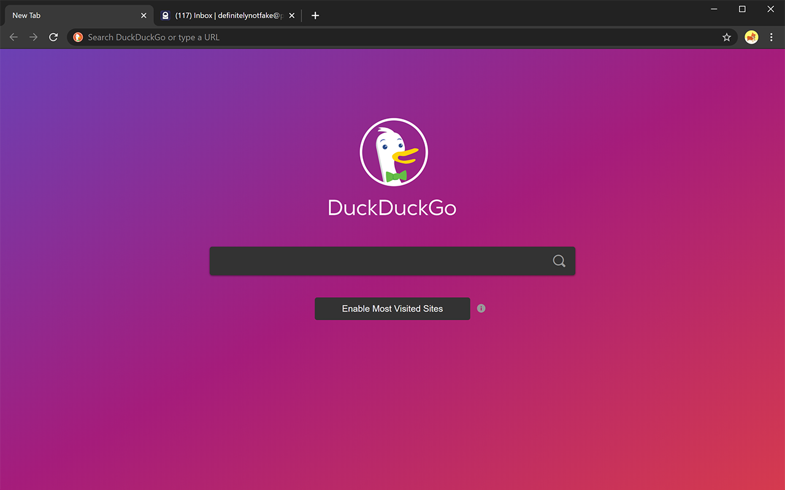
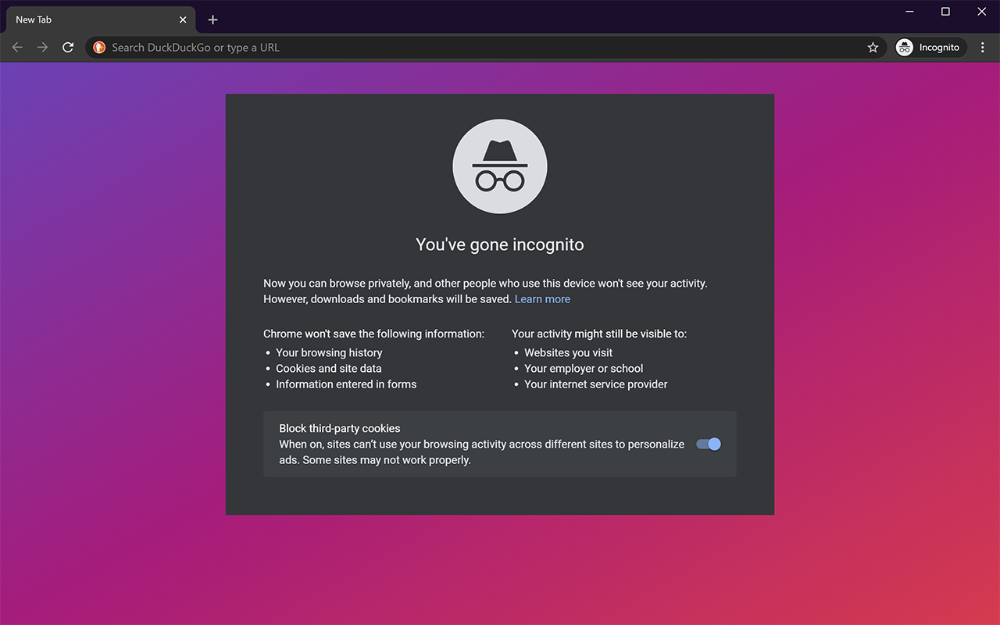

# Brave Dark Theme

Brave's dark theme, ported to Chrome and Chromium-based browsers that support theming.

I prefer Brave's default dark theme to Chrome's official dark themes, so I ported Brave's theme to Chrome. This theme uses the exact same colors as Brave does out of the box, complete with a 1440p gradient new tab page background supporting displays up to 8K (at 300% scaling). It's the closest you can get without modifying your browser's source code.

